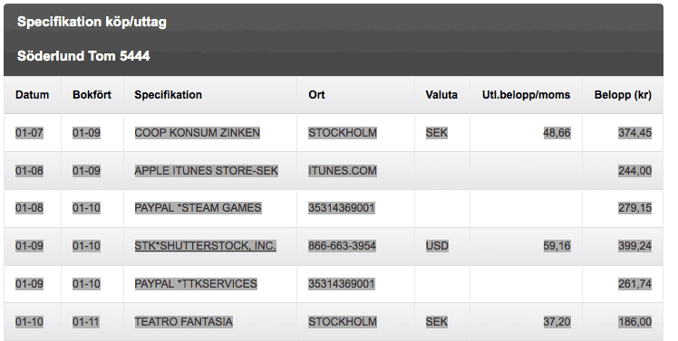

# Eurocard.se Exporter

Simple but customizable* web app that converts copied data from Eurocard.se transactions:

or when copied to text:

	01-07	01-09	
	COOP KONSUM ZINKEN
	STOCKHOLM	SEK	48,66	374,45
	01-08	01-09	
	APPLE ITUNES STORE-SEK
	ITUNES.COM			244,00
	01-08	01-10	
	PAYPAL *STEAM GAMES
	35314369001			279,15
	01-09	01-10	
	STK*SHUTTERSTOCK, INC.
	866-663-3954	USD	59,16	399,24
	01-09	01-10	
	PAYPAL *TTKSERVICES
	35314369001			261,74
	01-10	01-11	
	TEATRO FANTASIA
	STOCKHOLM	SEK	37,20	186,00

to the more usable format:

	Nr	Date	Description	Company	Receipt	Project	Category	Amount	Currency	Rate	Amount SEK	VAT	Excl. VAT	Owner
	1	2014-01-07	Food	Coop Konsum Zinken	PDF			374.45	SEK		374.45	48.66	325.79	Personal
	2	2014-01-08	iPhone apps: 	Apple App Store	PDF		5420. Dataprogram	244.00	SEK*		244.00		244.00	Tomorroworld
	3	2014-01-08	Games: 	Steam	PDF		5420. Dataprogram	279.15	SEK*		279.15		279.15	Tomorroworld
	4	2014-01-09	Photos/illustrations	Shutterstock	PDF		5990. Reklam, övrigt	59.16	USD		399.24		399.24	Tomorroworld
	5	2014-01-09	Virtual assistant	GetFriday	PDF		4600. Underentreprenad	261.74	SEK*		261.74		261.74	Tomorroworld
	6	2014-01-10	Teatro Fantasia					186.00	SEK		186.00	37.20	148.80	

## *Configuration

The file `config/config.json` contains settings for customization.